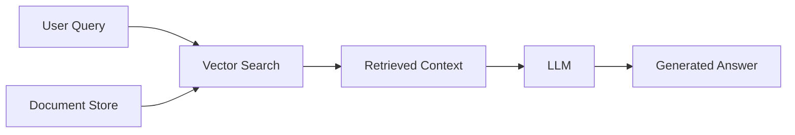
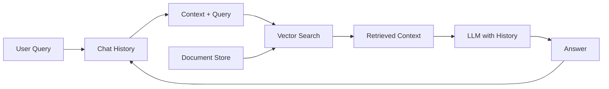
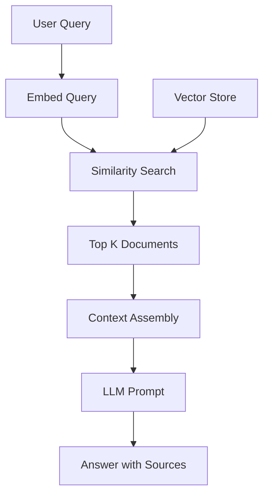
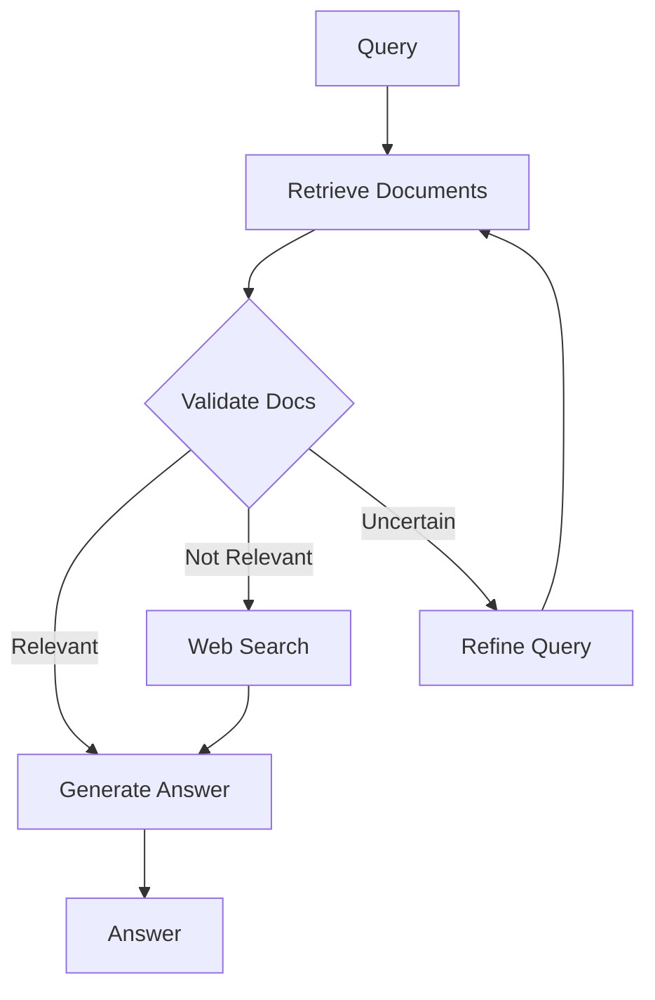
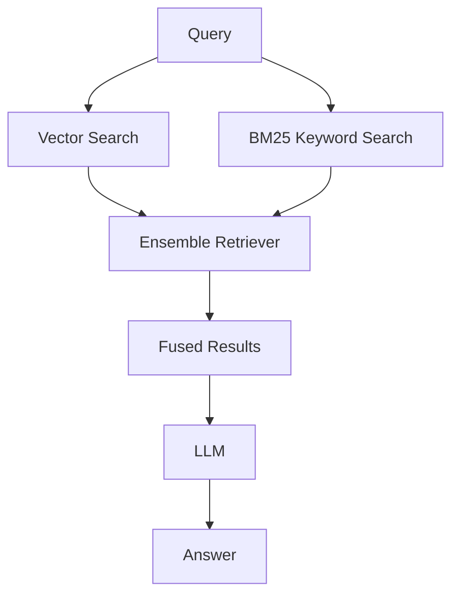
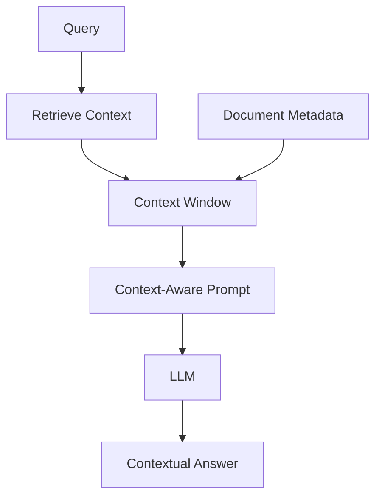
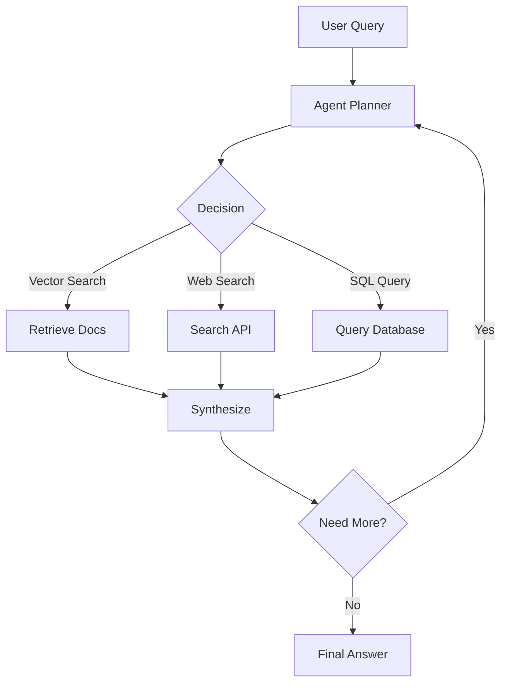
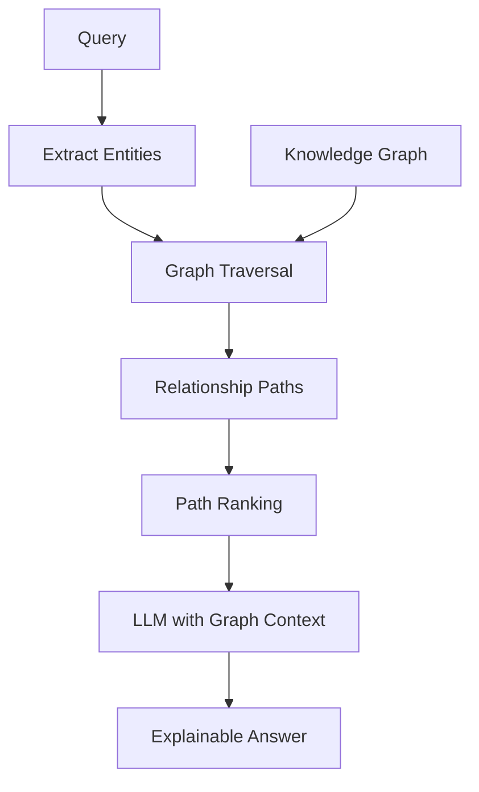

# RAG Architecture Diagrams

## 1. Simple (Naive) RAG

## 2. Conversational RAG

## 3. Standard RAG

## 4. Corrective RAG

## 5. Fusion RAG

## 6. Contextual RAG

## 7. Agentic RAG

## 8. Graph RAG

## Comparison Summary

| Architecture | Complexity | Use Case |
|-------------|------------|----------|
| Simple | Low | Basic Q&A |
| Conversational | Low | Chatbots with memory |
| Standard | Medium | Production Q&A with citations |
| Corrective | Medium | High accuracy requirements |
| Fusion | Medium | Hybrid search needs |
| Contextual | Medium | Documents with rich metadata |
| Agentic | High | Complex multi-step queries |
| Graph | High | Relationship reasoning |
